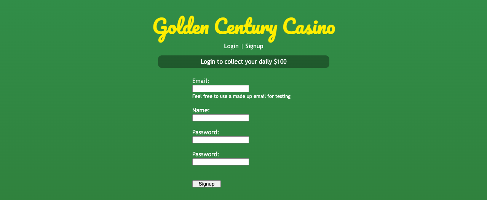
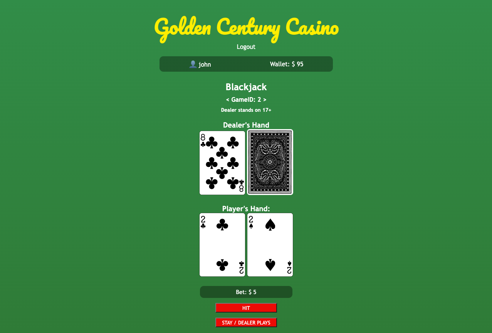
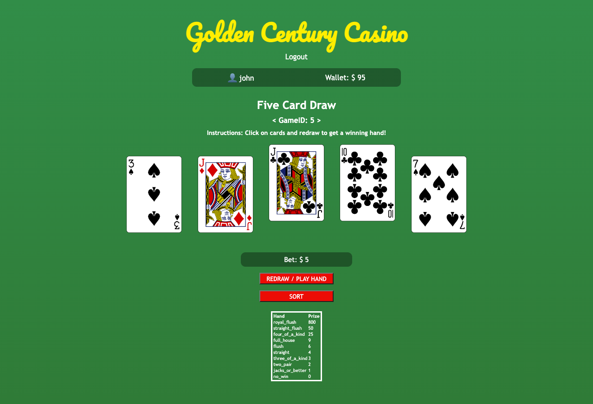

# Casino
A gaming platform that gives users daily credits to bet on classic casino-style card games. Current games feature Blackjack and 80’s Style Video Poker. Users can sign in to collect a daily currency bonus for use in betting. Game instances are preserved between sessions and unique to each user. Multiple users can make server requests with game logic handled on the side - user's can inspect the browser to overcome the games!

> Login or signup

> Collect your daily bonus cash and choose a game

> Blackjack

> Five card draw

## Developing locally
---
- Clone the repo 
- Create and activate python virtual environment
    > `$ python -m venv venv`\
    > `$ souce venv/bin/activate`
- Install requirements and technology
    > `$ pip install -r requirements.txt`
- Create a postgreSQL database called casino
    > `$ createdb casino`
- Use the *database_generation.sql* file to create the required tables in the model directory
- Run app.py
    > `$ python app.py`

## Future updates
---
- CSS refresh
- Implement an about page with instructions
- Implement a profile page, leaderboards and a shop to spend currency
- Add in a 'loading' symbol to smooth transitions
- Develop games into single page applications with async functionality
- Currently games are pickled into the database, to rewrite class construction based on saved JSON files
- Combine the player and user models into a single module and with the class
- Improve routing to game, fix the get / post requests

## Techonologies used
---
### Python
- Used to build all models of games
- Pyscopg2 to hand database 
- Bcrypt to handle password hashing
- Pickling to handle game instance storage and access on database

### Flask
- Flask framework to control routes and sessions
- Jinja to handle templating of webpages

### HTML
- Heavy use of forms for POSTS
- Semantic tags are used to seperate header, main, footer section

### CSS
- Imports google fonts for effects

### JS
- Minor use of JS to add event listeners to toggle classes and allow for routing via buttons

### PSQL
- At this stage 3 tables. Users, game_instances, game_types. 

### Deck of cards API
- Purely used to handle card image requests
- https://deckofcardsapi.com/

### Heroku
- Website was previously deployed on Heroku

## References
---
- https://en.wikipedia.org/wiki/Video_poker
